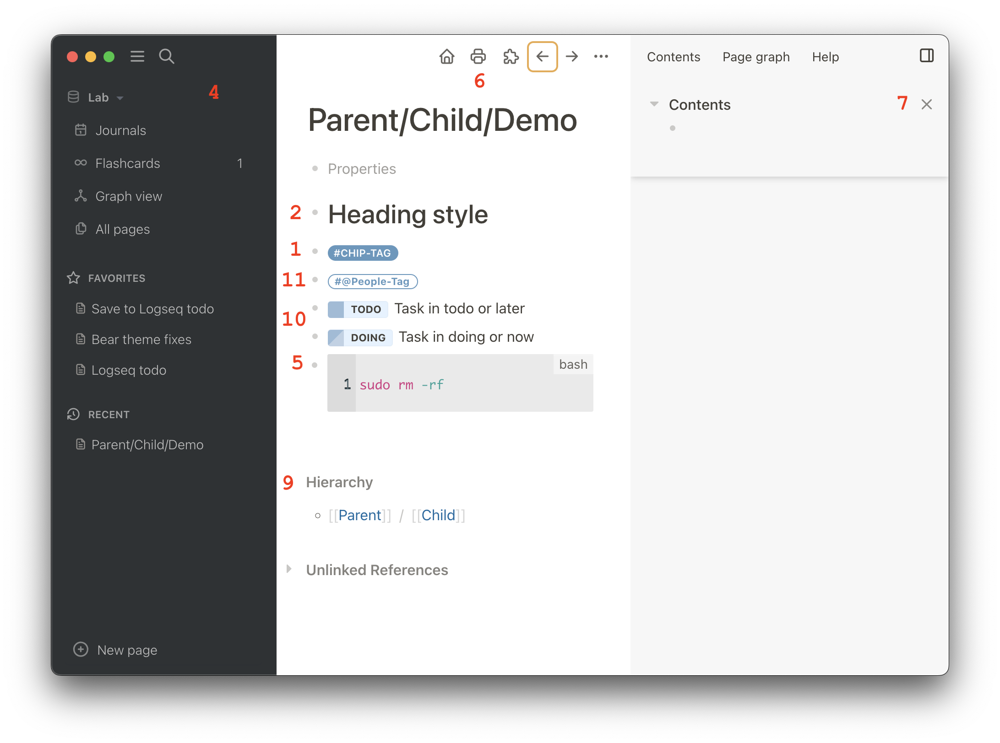

# Logseq Style Tweaks Plugin

This is a smorgasbord of small and large tweaks, activate the ones you like. The plugin is to be used together with the default themes (or custom ones) to tweak specific parts of Logseq's UI. List of tweaks:

1. **Tags as rounded chips**  
   Display tags as chips with rounded sides, background color, and uppercase.
2. **Smaller headings**  
   Display page title and headings in smaller sizes.
3. **System default font family**  
   Replace the font family for text and UI with the system default.
4. **Left sidebar always dark**  
   Use a dark left sidebar for both light and dark themes, in the style of Bear editor.
5. **Fix code block background**  
   Make code blocks use standard variables for background colors.
6. **Harmonise header icons color**  
   Make all header icons have the same color.
7. **Close button color**  
   Make the close buttons less eye-catching.
8. **Resize left sidebar**  
   Widen the left sidebars a bit.
9. **Harmonise "meta" headings**  
   Set the same font for references, hierarchy, and custom query titles.
10. **Tasks as chips**  
    Display tasks as a chip togheter with its label.
11. **@-tags as rounded chips**  
    Display tags starging with at "@" as chips with a rounded border and capitalised.

## How to

- Install it via Logseq marketplace.
- Go to Settings > Plugin Settings > Style Tweaks, turn on the tweaks you find useful.
- Reload Logseq (mod+r) for the UI changes to take effect.

## About

It should be fairly easy to figure out how to add your own tweaks if you download the plugin. You are also welcome to suggest new tweaks.

## Roadmap

- Figure out how to remove CSS when settings change - to be able to skip reload.
- Add parameters to each tweak: settings-config -> process automatically into CSS.
- Split tweaks config from settings config.
